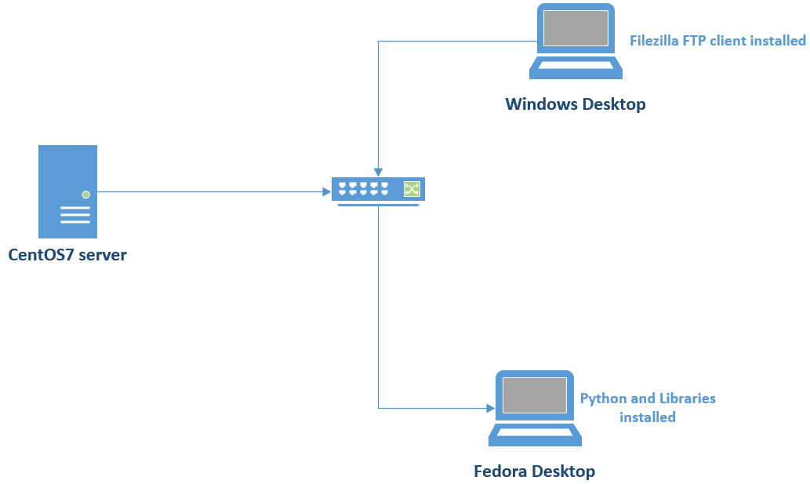

###CentOS7 VSFTPD FTPS server

#####This article shows us how to install and configure VSFTPD with FTPS configureation. Python code install and configure FTPS server to CentOS7 server. In CentOS7 server SeLinux is already enabled. In my example server IP address is 172.16.100.10. At the end we will check result with Clonezilla client from Windows desktop. Our network topology will be as following:


####For install needed libraries to your desktop environment read end of [this](https://github.com/jamalshahverdiev/c7cobblerpxe-ansible-vpshere) article.
#####Clone git repository to the local folder in your Linux Desktop. Go to already downloaded folder and execute install.py script:
```sh
$ https://github.com/jamalshahverdiev/CentOS7-VSFTPD-FTPS.git 
$ cd CentOS7-VSFTPD-FTPS
$ ./install.py
```


#####Script will ask you enter network card name to configure SeLinux and Firewall for FTPS:


#####Then go to the Windows desktop and open Filezilla client(Write username and password which you entered before and press Quickconnect button):


#####As we see we must accept certificate which FTPS server gives us:


#####Look at the result:

